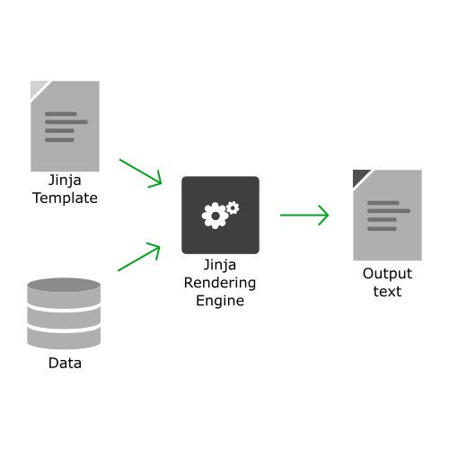

# jinja2 101

[](https://www.python.org/)
[](https://palletsprojects.com/projects/jinja/)

This is a `jinja2` quick start turtorial, which intend to help user quickly understand the basic knowledge and how to use `jinja2` with some simple examples.

- [Steps](#steps)
  - [1 Introduction​](#1-introduction)
  - [2 Variables](#2-variables)
  - [3 Control Structures - Conditionals and Loops​](#3-control-structures---conditionals-and-loops)
  - [4 Filters​](#4-filters)
  - [5 Macros​](#5-macros)
  
# Steps

## 1 Introduction

- Prerequisites
  - Python/conda
  - git client
  - visual code
    
- Create a GitHub account if you don't have one yet!

- Find our Github template repository [jinja2-101](https://github.com/saastool/jinja2-101)
- Click the big green 'Use this template' button and 'Create a new repository'.
- Create a new GitHub repository named **jinja2-101**.


1. Select Public so the repository can be shared with others. You can always make it private later.
2. Leave the default values for all other settings.
3. Click Create repository.
4. Save the commands from "…or create a new repository on the command line" to use later in Commit your changes.
5. Install and setup envrionment

- You Can Create python virtual env for jinja learning only
  - Make sure you have installed conda
  - For conda in Windows, open conda prompt terminal in system administrador priviledge

    ```command
    (base) ~ % conda create -n jinja 
    (base) ~ % conda activate jinja
    ```
    
- Install jinja2
  ```command
        (jinja) ~ % conda install jinja2
  ```
- Overview

  One can render any text or text file using Jinja like HTML, XML, LaTeX, SQL, etc. as long as it is pure text. 
  By providing a template and data to the Jinja rendering engine as input and it would outputs the text or text file.

  

- Repository Structure
  ```
  jinja2_101.py/
  |_ templates/
  |_ renders/
  ```
  
  
  **Jinja2_101.py** is the main function for calling jinja engine. It would:

  - Import the necessary libraries and components (objects, functions, etc.) from libraries.
    ```python
    from jinja2 import Environment, FileSystemLoader, Template
    ```
    
  - Create a jinja rendering environment and store it in a variable. This environment will be used in further steps.
    ```python
    env = Environment(loader = FileSystemLoader('template'))
    ```
    
  - Load the template (which stored in templates) in a variable.
    ```python
    template = env.get_template('_template.jinja')
    ```
    
  - Render the template using <template-object>.render() function to obtain text.
    ```python
    output = template.render()
    ```
  
  - Print the rendered text to the screen or a file as suitable and output into file in the renders folder.
    ```python
    print(output)
    with open("renders/_output.txt", 'w') as f:
      print(output, file = f)
    ```

## 2 Variables​​

Jinja allows you to insert variables into templates using the **Expression Delimiter: `{{ ... }}`**. Jinja would replace the placeholder from the given data.

- Open your project in your favorite code editor.
- Create a new jinja template file in the templates directory, named templates/**variable_template.jinja**
- Paste the following query into the templates/**variable_template.jinja** file.

```
Hello {{ name }}!
```

- Copy the **jinja2_101.py** and renamed **jinja.py**

  Edit step 3, make jinja engine get the template we just added
  ```python
  template = env.get_template('variable_template.jinja')
  ```

  Edit step 4, pass the data to jinja in order to replace the template placeholder
  ```python
  output = template.render(name='World')
  ```

  Edit step 5, store text into file with given file name 
  ```python
  with open("renders/variable_output.txt", 'w') as f:
  ```
  
  By given template and data, we can try jinja2
  ```bash
  python3 jinja.py
  ```

  The result can be checked by console or /renders/**variable_output.txt**, it should be
  ```
  Hello World!
  ```

## 3 Control Structures - Conditionals and Loops​

Jinja allows you to do some logistic controling by using **Statement Delimiter: ``**. Jinja would process the given control logics and replace the placeholder accordingly.

- Conditions
  
  - Open your project in your favorite code editor.
  - Create a new jinja template file in the templates directory, named templates/**conditional_template.jinja**
  - Paste the following query into the templates/**conditional_template.jinja** file.
  
  ```
  
  Hello, {{ user.name }}!
  
  Please activate your account.
  
  ```
  
  - Copy the **jinja2_101.py** and renamed **jinja.py**
  
    Edit step 3, make jinja engine get the template we just added
    ```python
    template = env.get_template('conditional_template.jinja')
    ```
  
    Edit step 4, pass the data to jinja in order to replace the template placeholder
    ```python
    output = template.render(user={'is_active': True, 'name': 'Alice'})
    ```
  
    Edit step 5, store text into file with given file name 
    ```python
    with open("renders/conditional_true_output.txt", 'w') as f:
    ```

    Copy step 4, 5 and append the **jinja2.py** python file, pass the data to jinja in order to replace the template placeholder for the not-active scenario 
    ```python
    output = template.render(user={'is_active': False, 'name': 'Bob'})
    print(output)
    
    with open("renders/conditional_false_output.txt", 'w') as f:
       print(output, file = f)
    ```
    
    By given template and data, we can try jinja2
    ```bash
    python3 jinja.py
    ```
  
    The result can be checked by console or /renders/**conditional_true_output.txt** and /renders/**conditional_false_output.txt**,
    the /renders/**conditional_true_output.txt** should be:
    ```
    Hello, Alice!
    ```
    and the /renders/**conditional_false_output.txt** should be:
    ```
    Please activate your account.
    ```

- loop
  
  - Open your project in your favorite code editor.
  - Create a new jinja template file in the templates directory, named templates/**loop_template.jinja**
  - Paste the following query into the templates/**loop_template.jinja** file.
  
  ```
  
  The current fruit name is {{ item }}
  
  ```
  
  - Copy the **jinja2_101.py** and renamed **jinja.py**
  
    Edit step 3, make jinja engine get the template we just added
    ```python
    template = env.get_template('loop_template.jinja')
    ```
  
    Edit step 4, pass the data to jinja in order to replace the template placeholder
    ```python
    output = template.render(items=['Apple', 'Banana', 'Cherry'])
    ```
  
    Edit step 5, store text into file with given file name 
    ```python
    with open("renders/loop_output.txt", 'w') as f:
    ```
    
    By given template and data, we can try jinja2
    ```bash
    python3 jinja.py
    ```
  
    The result can be checked by console or /renders/**loop_output.txt**, it should be:
    ```
    The current fruit name is Apple
    The current fruit name is Banana
    The current fruit name is Cherry
    ```
## 4 Filters​​

Jinja allows you to modify the variables by using the **Filters** with a pipe symbol (`|`) and may have optional arguments in parentheses (``).
See more built-in filters [here](https://jinja.palletsprojects.com/en/stable/templates/#builtin-filters).

- Open your project in your favorite code editor.
- Create a new jinja template file in the templates directory, named templates/**filter_template.jinja**
- Paste the following query into the templates/**filter_template.jinja** file.

```
Hello, {{ name|upper }}!
```

- Copy the **jinja2_101.py** and renamed **jinja.py**

  Edit step 3, make jinja engine get the template we just added
  ```python
  template = env.get_template('filter_template.jinja')
  ```

  Edit step 4, pass the data to jinja in order to replace the template placeholder
  ```python
  output = template.render(name='World')
  ```

  Edit step 5, store text into file with given file name 
  ```python
  with open("renders/filter_output.txt", 'w') as f:
  ```
  
  By given template and data, we can try jinja2
  ```bash
  python3 jinja.py
  ```

  The result can be checked by console or /renders/**filter_output.txt**, it should be
  ```
  Hello WORLD!
  ```
  Jinja accept multiple filter, just add `|` after `{{ ...|...|... }}`

## 5 Macros​​

Jinja allows you to defined and call reusable pieces of template code by using **Python Code**. By stating `macro` inside Statement Delimiter and use python codes to process the variable.
```

    < macro body >

```

- Open your project in your favorite code editor.
- Create a new jinja template file in the templates directory, named templates/**macro_template.jinja**
- Paste the following query into the templates/**macro_template.jinja** file.

```

  {{ date.strftime('%Y-%m-%d') }}

Date: {{ format_date(date) }}
```

- Copy the **jinja2_101.py** and renamed **jinja.py**

  Edit step 3, make jinja engine get the template we just added
  ```python
  template = env.get_template('macro_template.jinja')
  ```

  Edit step 4, import library and pass the data to jinja in order to replace the template placeholder
  ```python
  from datetime import datetime
  output = template.render(date=datetime.now())
  ```

  Edit step 5, store text into file with given file name 
  ```python
  with open("renders/macro_output.txt", 'w') as f:
  ```
  
  By given template and data, we can try jinja2
  ```bash
  python3 jinja.py
  ```

  The result can be checked by console or /renders/**macro_output.txt**, it should be
  ```
  Date:
    (Today's Date with YYYY-MM-DD)
  ```
- Sometimes white space and break line is intolerance or we simply want our text to be clean. We can add minus sign `-` to the start or end of a block , a comment, or a variable expression, the whitespaces before or after that block will be removed. Let's give it a try.

  Edit our templates/**macro_template.jinja** file.
  ```
  
  {{- date.strftime('%Y-%m-%d') }}
  
  Date: {{ format_date(date) }}
  ```

  Now the result would be like 
  ```
  Date: (Today's Date with YYYY-MM-DD)
  ```

So far we have learned the basic knowledge to using proper jinja, although Jinja has many deeper and complex usage (such as template inheritance) we didn't cover it in this basic turtorial. If you are interested in diving in, you can learn more at the [official website](https://jinja.palletsprojects.com/en/stable/templates/#template-inheritance).

Now, with the proper knowledge of jinja, we are ready to use jinja in DBT.
